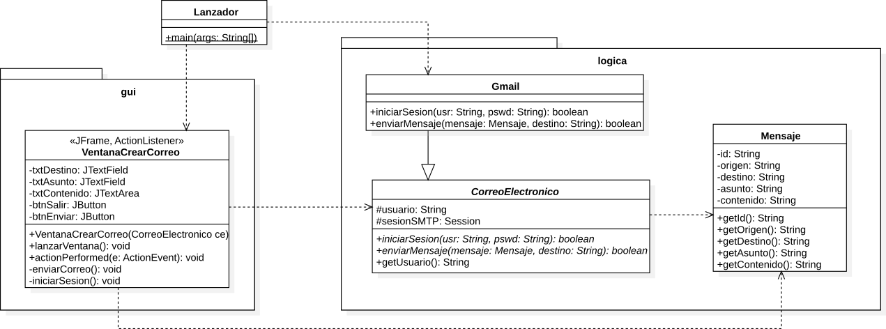
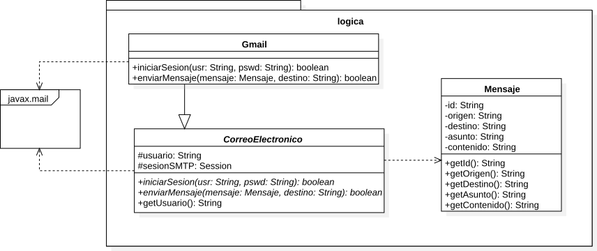

# JavaMail

Ejemplo de el uso de la librería JavaMil para el envío de correos electrónicos con Java.

### Enunciado de la aplicación propuesta

Se requiere una aplicación para manejar el correo electrónico, dicha aplicación  debe permitir al usuario iniciar sesión con su cuenta personal,  y enviar un mensaje básico (solo texto) con asunto y contenido a una dirección de destino específica.

### Solución propuesta

Se propone un modelo de clases bsico para manejar la aplicación separando la interfaz gráfica de usuario (gui) de la lógica d ela aplicación.

La implementación de la librería se realiza sobre dos clases dentro del paquete de la lógica.

> Ivan Dario Contreras P. 2016
